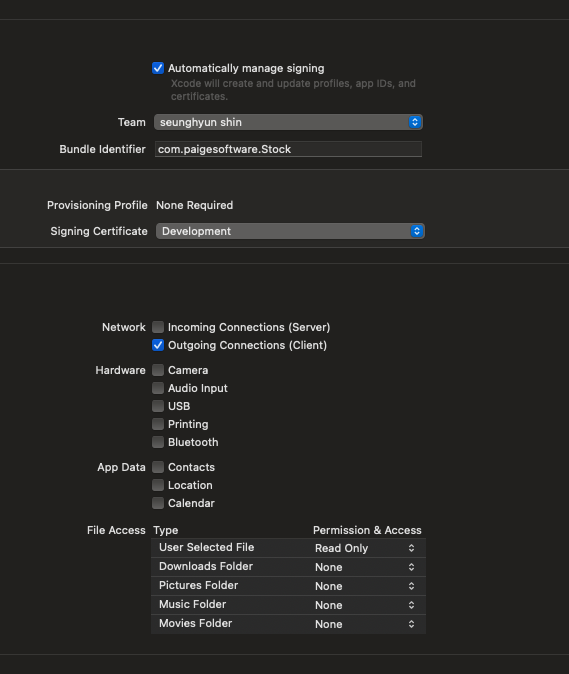

### Add Search Functionality on MacOS App SideBar

```swift
struct StockListScreen: View {
    
    @StateObject var vm: StockListViewModel
    
    @State private var search = ""
    
    init(vm: StockListViewModel) {
        self._vm = StateObject(wrappedValue: vm)
    }
    
    var body: some View {
        VStack {
            StockListView(stocks: self.vm.stocks)
                .searchable(text: self.$search, placement: .sidebar)
        } //: VStack
        .task {
            await self.vm.getStocks()
        }
    } //: body
}

```

### Enable Network Request on MacOS App 

- Check Outgoing Connections 




### Great Way To Display Double

```swift
"\(self.stock.price, specifier: "%.2f")"
```

### Hint For Search

```swift
self.vm.stocks.filter { $0.symbol.starts(with: self.search.uppercased()) }
```

### Secret Behind Realtime Updates

- Simply Use `Timer`

### News API

https://newsapi.org/

### SwiftUI task modifier dependency

```swift
            .task(id: self.stock) {
                await self.vm.fetchArticlesByStock(stock: self.stock)
            }
```

### WebView

```swift
import SwiftUI
import WebKit

struct WebView: NSViewRepresentable {
    
    let url: URL
    
    func makeNSView(context: Context) -> WKWebView {
        let webView = WKWebView()
        return webView
    }
    
    func updateNSView(_ webView: WKWebView, context: Context) {
        let request = URLRequest(url: self.url)
        webView.load(request)
    }
    
}


```

### Separate StateObject Strategy for efficiently rendering

```swift
import Foundation

final class AppState {
    
    var stockState: StocksState
    var routeState: RouteState
    
    init(stockState: StocksState = StocksState(), routeState: RouteState = RouteState()) {
        self.stockState = stockState
        self.routeState = routeState
    }
    
}

class StocksState: ObservableObject {
    @Published var stocks: [StockViewModel] = []
    func stockBySymbol(_ symbol: String) -> StockViewModel? {
        guard let stock = (self.stocks.first { $0.symbol == symbol }) else {
            return nil
        }
        return stock
    }
}

class RouteState: ObservableObject {
    @Published var route: Route = .businessArticles
}

```

```swift
    private let appState = AppState()
    
    var body: some Scene {
        WindowGroup {
            HomeScreen()
                .frame(minWidth: 600, minHeight: 600)
                .environmentObject(self.appState.routeState)
                .environmentObject(self.appState.stockState)
        }
    }
```
